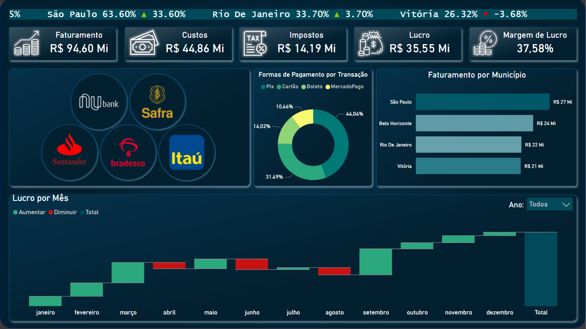
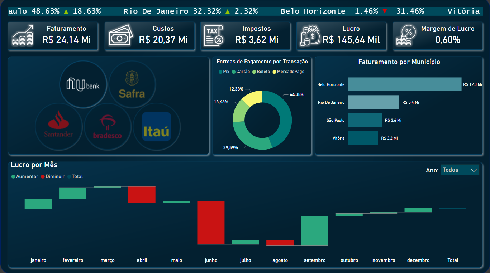
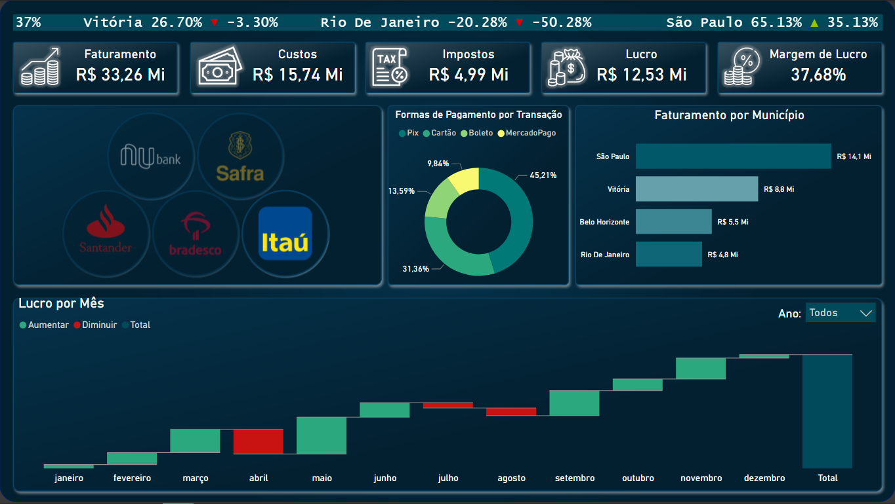
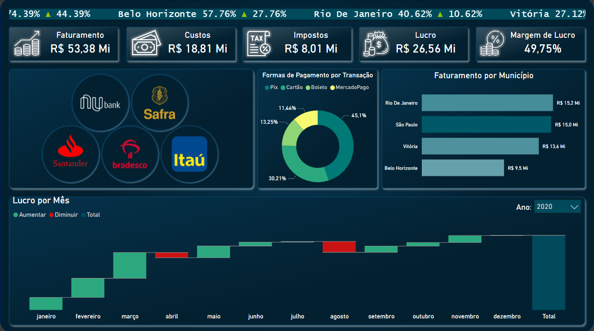

# 💰 Dashboard Financeiro - Power BI

## 📌 Descrição

Este projeto apresenta um Dashboard Financeiro desenvolvido no Power BI para acompanhamento dos principais indicadores financeiros da empresa de forma visual, intuitiva e interativa.

O dashboard permite analisar faturamento, custos, impostos, lucro, margem de lucro, formas de pagamento, faturamento por município e evolução do lucro ao longo dos meses, além de possibilitar análises específicas através de filtros por instituição financeira.

---

## 📊 Indicadores Monitorados

- Faturamento Total
- Custos Totais
- Impostos
- Lucro
- Margem de Lucro
- Formas de Pagamento
- Faturamento por Município
- Lucro por Mês
- Variação Percentual por Município

---

## 🎯 Funcionalidades

- Filtros interativos por instituição financeira
- Comparação de desempenho entre municípios
- Análise da distribuição das formas de pagamento
- Acompanhamento da evolução do lucro mensal
- Indicadores financeiros atualizados dinamicamente
- Interface moderna e responsiva

---

## 🖼️ Dashboard

### Visão Geral



### Filtro - Nubank



### Filtro - Itaú



### Filtro - Ano



---

## 📈 Análises Possíveis

- Identificar os municípios com maior faturamento.
- Avaliar a rentabilidade da operação.
- Analisar o impacto dos impostos sobre os resultados.
- Entender a participação de cada forma de pagamento.
- Comparar o desempenho financeiro entre diferentes bancos.
- Monitorar a evolução do lucro ao longo do ano.

---

## 🛠️ Ferramentas Utilizadas

- Power BI
- Power Query
- DAX
- Modelagem de Dados

---

## 📂 Estrutura do Projeto

```text
Dashboard-Financeiro/
│
├── Dashboard Financeiro.pbix
├── README.md
└── Imagens/
    ├── dashboard-geral.png
    ├── filtro-nubank.png
    └── filtro-itau.png
```

---

## 🚀 Objetivo

Este projeto foi desenvolvido para praticar conceitos de análise de dados, modelagem de indicadores financeiros e criação de dashboards interativos utilizando Power BI.
